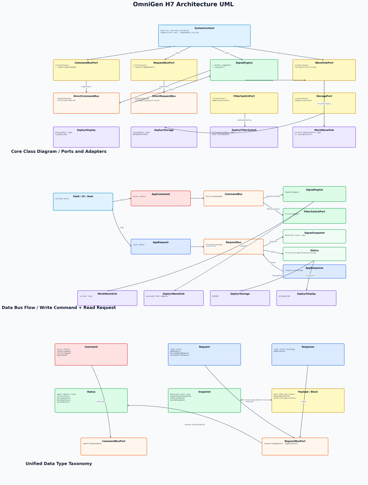
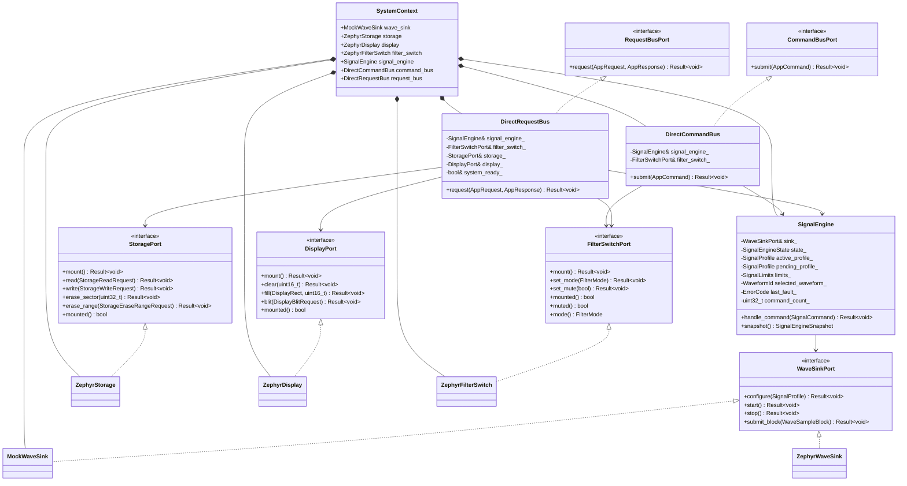
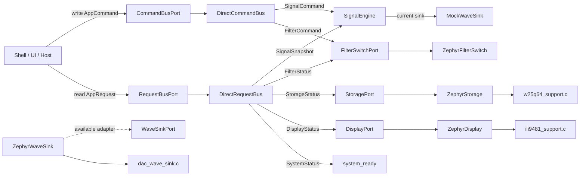
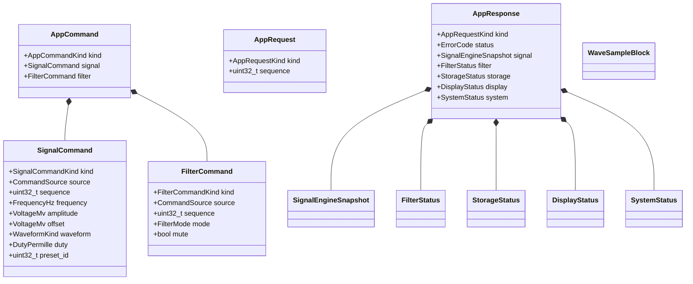

# OmniGen H7 Architecture UML

This document records the current OmniGen H7 architecture UML. The PNG is generated from a local drawing script, while the Mermaid source is kept below for maintenance.

## PNG

## 1. Core Class Diagram

## 2. Data Bus Flow

## 3. Data Type Diagram

